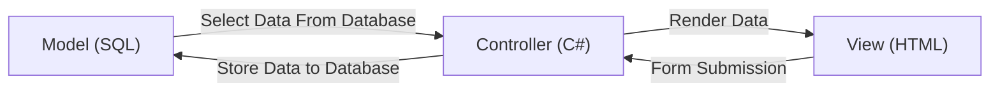

# Steps

- M - Model (SQL)
- V - View (HTML)
- C - Controller (C#)

## Data To Send From Server

- total_today_sales (Decimal)
- total_today_num_orders (Int)
- total_today_num_refunds (Int)
- total_yesterday_sales (Decimal)
- total_yesterday_num_orders (Int)
- total_yesterday_num_refunds (Int)
- total_monthly_sales (Decimal)
- total_monthly_num_orders (Int)
- total_monthly_num_refunds (Int)

- total_online_Machine (Int)
- total_offline_Machine (Int)
- total_outage_Machine (Int)
- User Table (List)

## Tasks

## 25%

- [x] 5 Store Procedure
  - [x] NSP_TMachine_StatusData
  - [x] NSP_TOrderTransaction_TdySales
  - [x] NSP_TOrderTransaction_YtdSales
  - [x] NSP_TOrderTransaction_MthSales
  - [x] NSP_TTemp_SelectAll
- [x] Pass Data from SQL to C#
  - [x] 1/2
  - [x] 2/2
- [x] Pass Data From C# to HTML
  - [x] 1/2
  - [x] 2/2 (Pass List Data) (Tmr)

- [ ] Pass Data From C# to SQL (Future)
- [ ] Pass Data From HTML to C# (Future)

## How to Pass Data From Database (SQL) to Controller (C#)

## How to pass data from Controller (C#) to View (HTML)

## How to pass data from View (HTML) to Controller (C#)

## How to pass data from Controller (C#) To DataBase (SQL)
